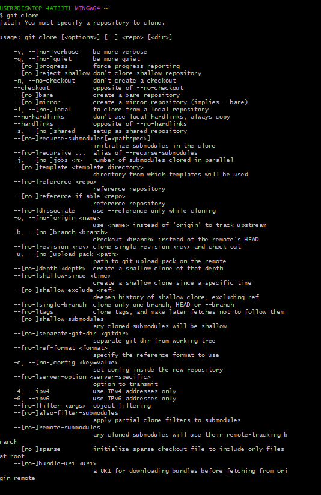
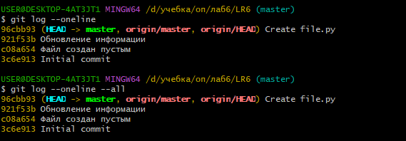
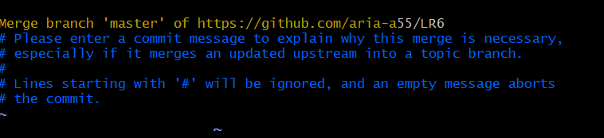
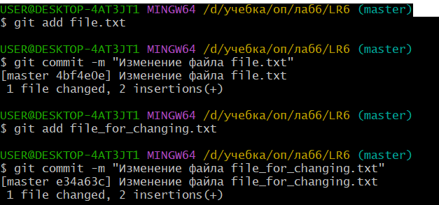
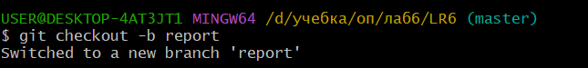

# LR6
Лабораторная работа №6
## Система контроля версий Git

### Цель работы:
изучение базовых возможностей системы
управления версиями, опыт работы с Git Api, опыт работы с локальным и
удаленным репозиторием.

### Ход работы:

1. Клонирование репозитория на компьютер(рисю image.png)

2. Получения истории операций

3. Слияние двух веток(рис. image-2.png)

4. Удаление побочной ветки командой 
git branch -d conclusion

5. Измненение файлов и фиксирование изменений(рис. image-3.png)

6. Откат коммита (рис. image-4.png)

7. Создание ветки для отчета
